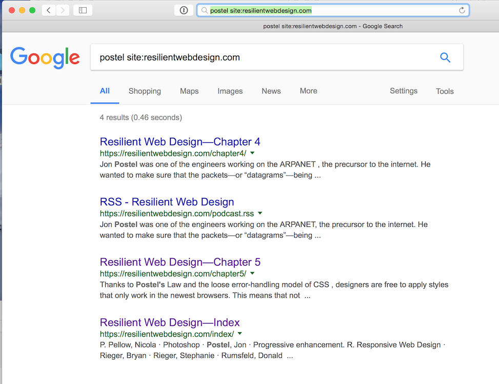
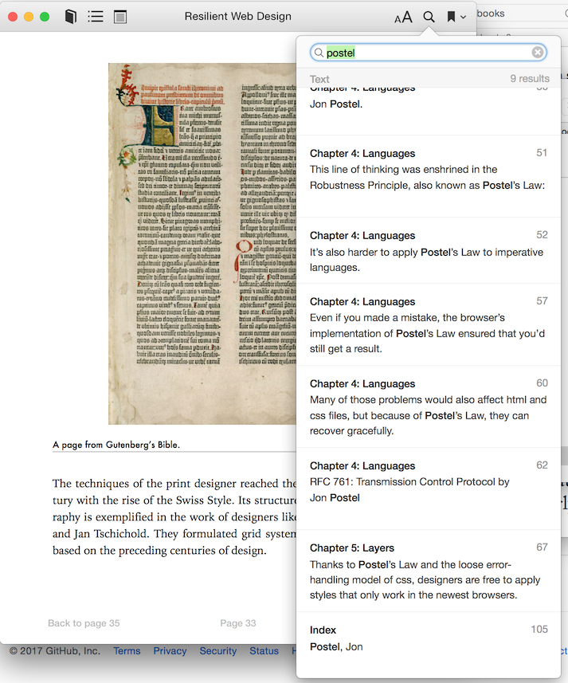

# Reading a book on the web

Is a book a web site? A progressive web app? Something more? Does the web need new features to truly support books? What can we learn from experiments with web books, from the experience of EPUB, from the history of browsers?

## 1. Web Books: What's Out There?

It's so much easier to talk about something when you have something to talk about.

When talking about web books, I like to look at Jeremy Keith's [Resilient Web Design](https://resilientwebdesign.com/) (henceforth "RWD"). I think of this as the state of the art for books on the web today.

## 2. Ideas of Order: Document Boundaries and Sequence

What's important about books fits in a single sentence—chapter two comes after chapter one, but they're both part of the same book.

With RWD, we have a landing page with a table of contents. We can click on "Introduction," which comes next. Or there's the same link from the "begin reading now" text. 

But, if you're using Opera 12, you can read the entire book just by clicking the space bar. That's because of the magic of rel=next, HTML’s way of defining a sequence of documents. Sadly, current browsers don't seem to do much with the [sequential link types](https://html.spec.whatwg.org/#sequential-link-types).

### What we've tried

1. Using `<nav>` element to describe ordered list of links that make up the publication.

Pros: very webby, needed anyway, just the right semantics.

Cons: not JSON, doesn't work well for more experimental publications?, people keep saying their book doesn't need a TOC

2. XML. EPUB has an xml package file, that contains an ordered list of primary resources ("the guide")

Pros: Works. 

Cons: XML.

3. rel=prev/next.

Pros. Webby. 

Cons. Still need global information

## 3. I'll Finish It Tomorrow: Retaining State

I read half of chapter three, and then had to do something else with my browser. 

If I can get back to the URL with the forward or back button on my browser, it will remember that I'm halfway down the page because of the back/forward cache. If I have to reload the URL, or if I quit the browser, I'm out of luck.

My ebook reader even remembers where I was after I switched from my phone to my tablet.

### What we've tried

I actually don't know how ebook reading systems do this.

## 4. This Font Hurts My Eyes: Personalization

With regular browser pages, if you want to change the font, you have to figure out how user stylesheets work, and write some CSS. It's not so simple that a C-level executive can do it.

If I switch to a browser reading mode, the situation is better. I might be able to choose a serif or sans-serif font. I can change the background. I can easily make the text bigger. But why is it now telling me how long this will take to read? What happened to the design? [Why did my H2 disappear](link needed)?

All these features are routine in ebook readers. 

### What we've tried

1. Creating menu bar with JS with customization controls, then write style information to document 

## 5. Reading on the Train: Offline

I'm reading RWP on the train, and go into a tunnel (let's pretend we're in Europe, where there are trains). I can keep reading because the book works offline, thanks to service workers and appcache. Good job.

### What we've tried

Service workers! They work. Bigbluehat even found a sneaky way to cache secondary resources without an explicit list of them :)

Issue: what happens when I come back to my book after a year?

Issue: what happens when I have a thousand books saved?

## 6. Mine.

I want to save a copy of the book. Easy on Android, harder on iOS, really difficult on desktop. 

What happens if the server goes away? What if I want to back up my copy of the book? 

### What we've tried

From a SW cache, you can programmatically create EPUB, ZIP, the new Google Web Package, the old Jeni Tennison web package, whatever. 

## 7.  Search

What if I want to find something in the book? I hit command-F in my browser, and I can search the current document, but not the book. 

I have to go to google and type a search term followed by site:resilientwebdesign.com.

It's much easier in iBooks:

Almost uniquely, for something on the web, RWD does have an index. But if I find "Postel" in the index, it only links to the chapter 4 discussion, not the mention in chapter 5.

### What we've tried

I did a prototype where the <nav> element defined the book contents and structure. I created link/@rel=import for each item, and then used HTML imports to add them to the original DOM. Kinda messy, but browser search then works for the whole publication :)

## 8. Highlights.

Highlights, bookmarks, annotations--the web is working on this. 

## 9. Navigate

There are nine copies of the table of contents in RWD. 

EPUB is infamous for duplication, but there are usually only two copies of the TOC in a book.

### What we've tried

## Epilogue: What Have We learned?

1. We have a finite sequence of web resources,

2. With user requirements around 

search, 
personalization, 
annotation,
saving state,
and robust offline support.

3. That's it!

